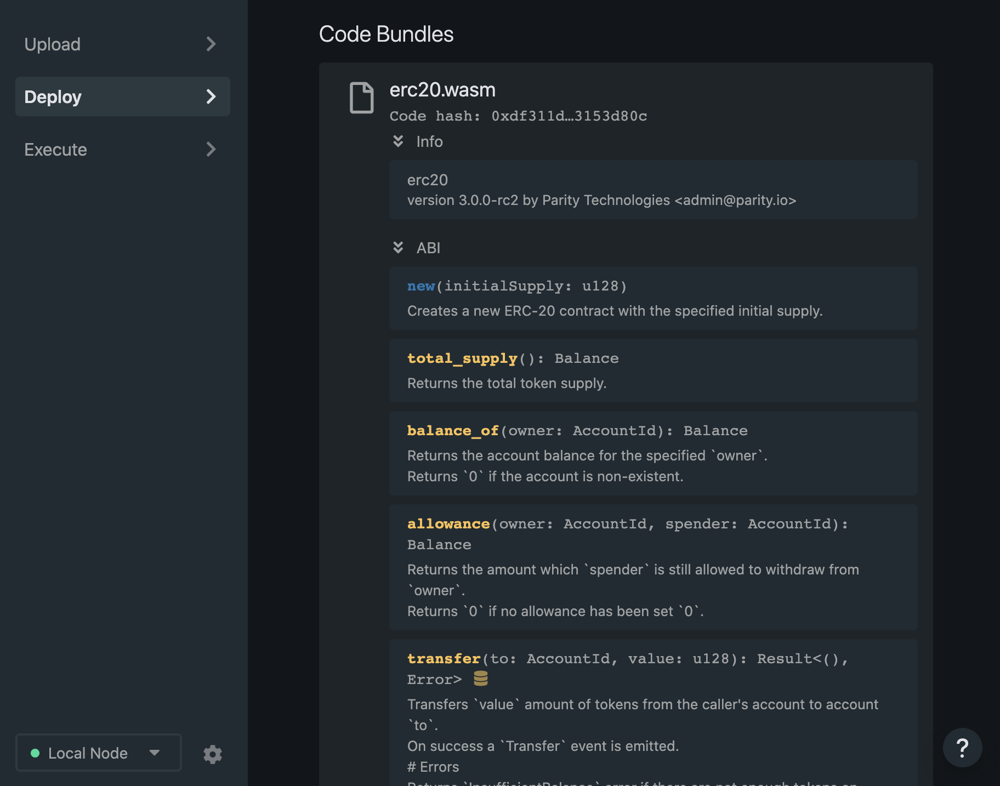
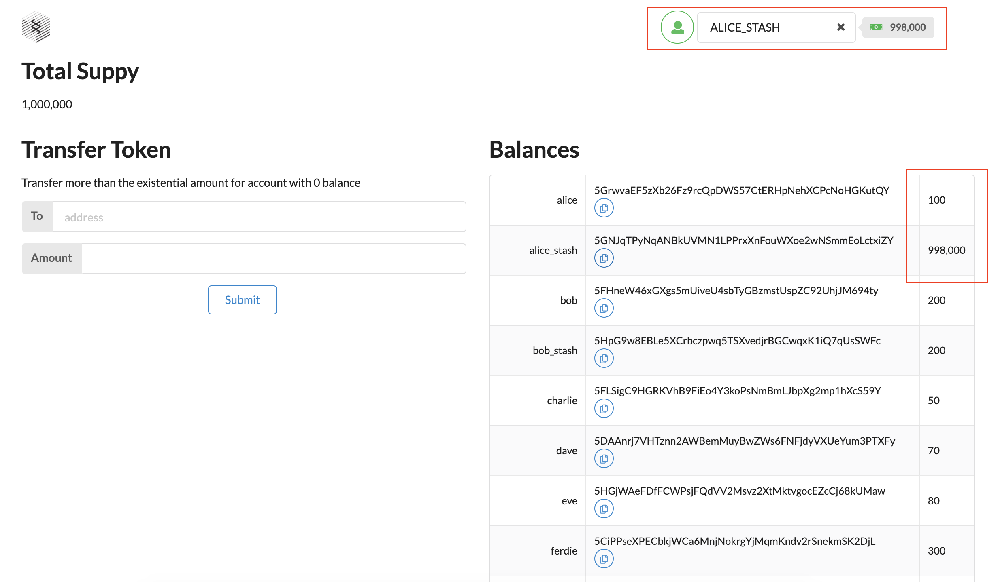
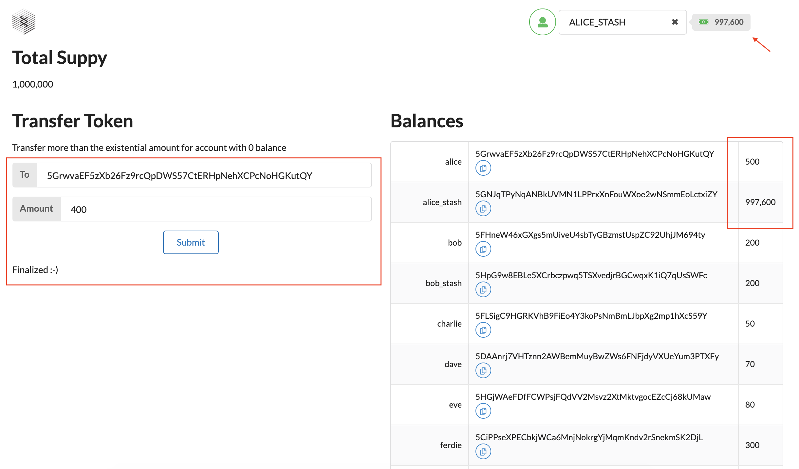

# ERC-20 smart contract with ink

Challenge: https://gitcoin.co/issue/Polkadot-Network/hello-world-by-polkadot/9/100023935

## Project modules

- Node ./substrate-node-template
- Contract ./ink-contract
- UI ./substrate-front-end-template

## Screenshots

### Contract deployed

### Token tranfer (Before)

### Token transfer (After)

